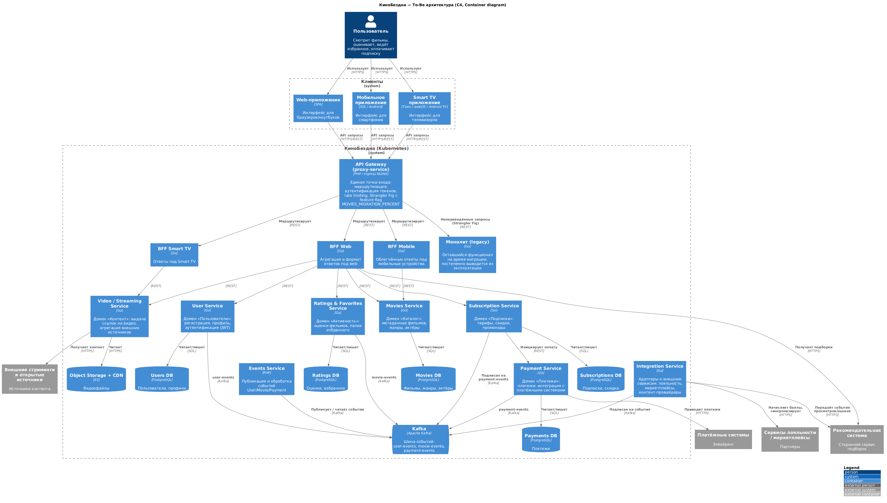
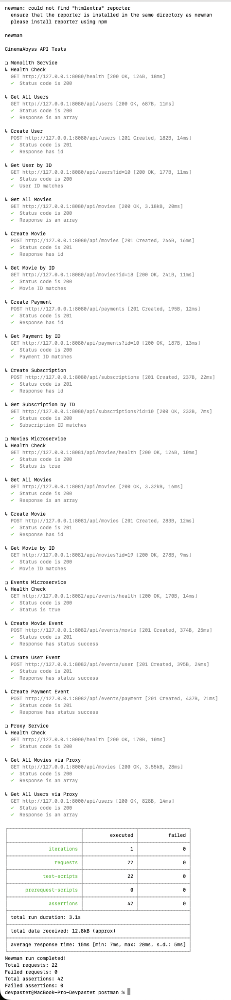
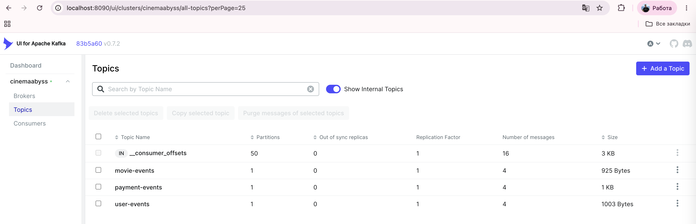
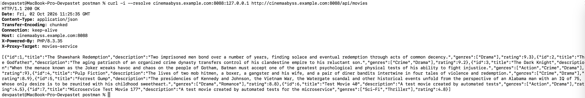
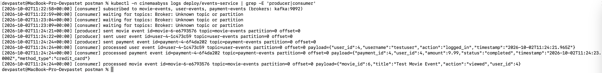
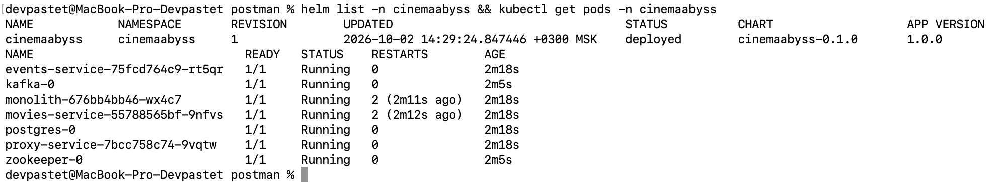
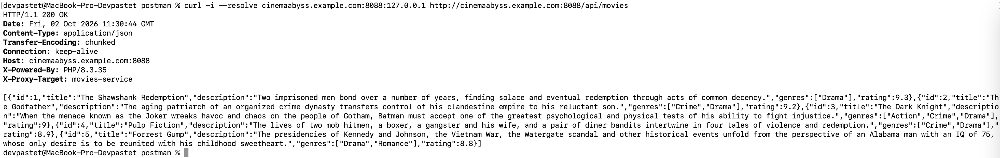

## Изучите [README.md](.\README.md) файл и структуру проекта.

# Задание 1

1. Спроектируйте to be архитектуру КиноБездны, разделив всю систему на отдельные домены и организовав интеграционное взаимодействие и единую точку вызова сервисов.
Результат представьте в виде контейнерной диаграммы в нотации С4.
Добавьте ссылку на файл в этот шаблон
[ссылка на файл](docs/architecture/cinemaabyss-to-be-container.puml) (исходник C4-PlantUML), [PNG](docs/architecture/cinemaabyss-to-be-container.png)



**Решение.** Система разделена на домены, у каждого свой сервис и своя БД (database per service):

| Домен | Сервис | Данные |
|---|---|---|
| Пользователи и аутентификация | User Service | Users DB |
| Каталог (метаданные фильмов: жанры, актёры) | Movies Service | Movies DB |
| Активность (оценки, избранное) | Ratings & Favorites Service | Ratings DB |
| Контент (видео, внешние источники) | Video / Streaming Service | Object Storage + CDN |
| Подписки и скидки | Subscription Service | Subscriptions DB |
| Платежи | Payment Service | Payments DB |
| Интеграции (лояльность, маркетплейсы, рекомендации) | Integration Service | — |

- **Единая точка входа** — API Gateway (proxy-service за Ingress NGINX): маршрутизация, проверка токенов, rate limiting и постепенное переключение трафика с монолита на новые сервисы (Strangler Fig + feature flag).
- **Разные клиенты** (web, mobile, Smart TV) получают данные через отдельные BFF, которые агрегируют ответы сервисов и отдают нужный объём данных под устройство.
- **Интеграционное взаимодействие**: синхронные запросы (REST) — для запросов пользователя; асинхронные — через Kafka (`user-events`, `movie-events`, `payment-events`). Например, Subscription Service продлевает подписку по событию из `payment-events`, Integration Service по событиям начисляет баллы лояльности и передаёт данные в рекомендательную систему.
- **Монолит** остаётся за API Gateway, пока из него не вынесены все домены, после чего выводится из эксплуатации.
- Всё развёрнуто в Kubernetes, установка через Helm, сборка через GitHub Actions.

# Задание 2

### 1. Proxy
Команда КиноБездны уже выделила сервис метаданных о фильмах movies и вам необходимо реализовать бесшовный переход с применением паттерна Strangler Fig в части реализации прокси-сервиса (API Gateway), с помощью которого можно будет постепенно переключать траффик, используя фиче-флаг.


Реализуйте сервис на любом языке программирования в ./src/microservices/proxy.
Конфигурация для запуска сервиса через docker-compose уже добавлена
```yaml
  proxy-service:
    build:
      context: ./src/microservices/proxy
      dockerfile: Dockerfile
    container_name: cinemaabyss-proxy-service
    depends_on:
      - monolith
      - movies-service
      - events-service
    ports:
      - "8000:8000"
    environment:
      PORT: 8000
      MONOLITH_URL: http://monolith:8080
      #монолит
      MOVIES_SERVICE_URL: http://movies-service:8081 #сервис movies
      EVENTS_SERVICE_URL: http://events-service:8082 
      GRADUAL_MIGRATION: "true" # вкл/выкл простого фиче-флага
      MOVIES_MIGRATION_PERCENT: "50" # процент миграции
    networks:
      - cinemaabyss-network
```

- После реализации запустите postman тесты - они все должны быть зеленые (кроме events).
- Отправьте запросы к API Gateway:
   ```bash
   curl http://localhost:8000/api/movies
   ```
- Протестируйте постепенный переход, изменив переменную окружения MOVIES_MIGRATION_PERCENT в файле docker-compose.yml.

**Решение.** Прокси реализован на PHP: [src/microservices/proxy](src/microservices/proxy) ([index.php](src/microservices/proxy/index.php), [Dockerfile](src/microservices/proxy/Dockerfile)).

- `GET /health` — health-check прокси.
- `/api/movies*` — если `GRADUAL_MIGRATION=true`, запрос с вероятностью `MOVIES_MIGRATION_PERCENT`% уходит в `movies-service`, иначе — в монолит. Если `GRADUAL_MIGRATION=false`, весь трафик идёт в монолит.
- `/api/events*` — в `events-service`.
- Все остальные запросы (users, payments, subscriptions) — в монолит.
- В ответ добавляется заголовок `X-Proxy-Target`, а в лог пишется, куда ушёл запрос, поэтому переключение трафика хорошо видно.

Проверка распределения при `MOVIES_MIGRATION_PERCENT: "50"`:
```bash
for i in $(seq 1 10); do curl -s -o /dev/null -D - http://localhost:8000/api/movies | grep X-Proxy-Target; done | sort | uniq -c
   4 X-Proxy-Target: monolith
   6 X-Proxy-Target: movies-service
```
При `"0"` все запросы уходят в монолит, при `"100"` — в movies-service.

В docker-compose.yml для monolith и movies-service добавлены `depends_on: condition: service_healthy` для postgres и `restart: on-failure`: без этого они падали на старте, если Postgres ещё не был готов.


### 2. Kafka
 Вам как архитектуру нужно также проверить гипотезу насколько просто реализовать применение Kafka в данной архитектуре.

Для этого нужно сделать MVP сервис events, который будет при вызове API создавать и сам же читать сообщения в топике Kafka.

    - Разработайте сервис на любом языке программирования с consumer'ами и producer'ами.
    - Реализуйте простой API, при вызове которого будут создаваться события User/Payment/Movie и обрабатываться внутри сервиса с записью в лог
    - Добавьте в docker-compose новый сервис, kafka там уже есть

Необходимые тесты для проверки этого API вызываются при запуске npm run test:local из папки tests/postman 
Приложите скриншот тестов и скриншот состояния топиков Kafka из UI http://localhost:8090 

**Решение.** Сервис на PHP с расширением `rdkafka`: [src/microservices/events](src/microservices/events).

- [index.php](src/microservices/events/index.php) — HTTP API по спецификации: `GET /api/events/health`, `POST /api/events/movie|user|payment`. Producer отправляет событие в топик `movie-events` / `user-events` / `payment-events` и возвращает `201` с `status`, `partition`, `offset` и самим событием.
- [consumer.php](src/microservices/events/consumer.php) — consumer (группа `events-service`) подписан на все три топика и пишет каждое обработанное событие в лог сервиса.
- [entrypoint.sh](src/microservices/events/entrypoint.sh) запускает consumer в фоне (с перезапуском) и HTTP-сервер.
- Сервис добавлен в docker-compose.yml (`KAFKA_BROKERS: kafka:9092`).

Результат `npm run test:local` — 22 запроса, 42 проверки, 0 ошибок (все тесты, включая events, зелёные).

Лог events-service:
```
[producer] sent movie event id=movie-12-0e8e1be0 topic=movie-events partition=0 offset=0
[producer] sent user event id=user-7-8b1cb8bc topic=user-events partition=0 offset=0
[producer] sent payment event id=payment-7-13406313 topic=payment-events partition=0 offset=0
[consumer] processed user event id=user-7-8b1cb8bc topic=user-events partition=0 offset=0 payload={"user_id":7,"username":"testuser","action":"logged_in",...}
[consumer] processed payment event id=payment-7-13406313 topic=payment-events partition=0 offset=0 payload={"payment_id":7,"user_id":7,"amount":9.99,"status":"completed",...}
[consumer] processed movie event id=movie-12-0e8e1be0 topic=movie-events partition=0 offset=0 payload={"movie_id":12,"title":"Test Movie Event","action":"viewed","user_id":7}
```

Скриншот тестов:



Скриншот топиков Kafka UI:



# Задание 3

Команда начала переезд в Kubernetes для лучшего масштабирования и повышения надежности. 
Вам, как архитектору осталось самое сложное:
 - реализовать CI/CD для сборки прокси сервиса
 - реализовать необходимые конфигурационные файлы для переключения трафика.


### CI/CD

 В папке .github/worflows доработайте деплой новых сервисов proxy и events в docker-build-push.yml , чтобы api-tests при сборке отрабатывали корректно при отправке коммита в ваш репозиторий.

Нужно доработать 
```yaml
on:
  push:
    branches: [ main ]
    paths:
      - 'src/**'
      - '.github/workflows/docker-build-push.yml'
  release:
    types: [published]
```
и добавить необходимые шаги в блок
```yaml
jobs:
  build-and-push:
    runs-on: ubuntu-latest
    permissions:
      contents: read
      packages: write

    steps:
      - name: Checkout repository
        uses: actions/checkout@v3

      - name: Set up Docker Buildx
        uses: docker/setup-buildx-action@v2

      - name: Log in to the Container registry
        uses: docker/login-action@v2
        with:
          registry: ${{ env.REGISTRY }}
          username: ${{ github.actor }}
          password: ${{ secrets.GITHUB_TOKEN }}

```
Как только сборка отработает и в github registry появятся ваши образы, можно переходить к блоку настройки Kubernetes
Успешным результатом данного шага является "зеленая" сборка и "зеленые" тесты

**Решение.** В [docker-build-push.yml](.github/workflows/docker-build-push.yml) добавлены шаги сборки и публикации образов `proxy-service` и `events-service` в `ghcr.io` (по аналогии с monolith и movies-service), а в триггер `push` добавлена ветка `cinema`. В [api-tests.yml](.github/workflows/api-tests.yml) тесты также запускаются на push в `cinema`.


### Proxy в Kubernetes

#### Шаг 1
Для деплоя в kubernetes необходимо залогиниться в docker registry Github'а.
1. Создайте Personal Access Token (PAT) https://github.com/settings/tokens . Создавайте class с правом read:packages
2. В src/kubernetes/*.yaml (event-service, monolith, movies-service и proxy-service)  отредактируйте путь до ваших образов 
```bash
 spec:
      containers:
      - name: events-service
        image: ghcr.io/ваш логин/имя репозитория/events-service:latest
```
3. Добавьте в секрет src/kubernetes/dockerconfigsecret.yaml в поле
```bash
 .dockerconfigjson: значение в base64 файла ~/.docker/config.json
```

4. Если в ~/.docker/config.json нет значения для аутентификации
```json
{
        "auths": {
                "ghcr.io": {
                       тут пусто
                }
        }
}
```
то выполните 

и добавьте

```json 
 "auth": "имя пользователя:токен в base64"
```

Чтобы получить значение в base64 можно выполнить команду
```bash
 echo -n ваш_логин:ваш_токен | base64
```

После заполнения config.json, также прогоните содержимое через base64

```bash
cat .docker/config.json | base64
```

и полученное значение добавляем в

```bash
 .dockerconfigjson: значение в base64 файла ~/.docker/config.json
```

#### Шаг 2

  Доработайте src/kubernetes/event-service.yaml и src/kubernetes/proxy-service.yaml

  - Необходимо создать Deployment и Service 
  - Доработайте ingress.yaml, чтобы можно было с помощью тестов проверить создание событий
  - Выполните дальшейшие шаги для поднятия кластера:

  1. Создайте namespace:
  ```bash
  kubectl apply -f src/kubernetes/namespace.yaml
  ```
  2. Создайте секреты и переменные
  ```bash
  kubectl apply -f src/kubernetes/configmap.yaml
  kubectl apply -f src/kubernetes/secret.yaml
  kubectl apply -f src/kubernetes/dockerconfigsecret.yaml
  kubectl apply -f src/kubernetes/postgres-init-configmap.yaml
  ```

  3. Разверните базу данных:
  ```bash
  kubectl apply -f src/kubernetes/postgres.yaml
  ```

  На этом этапе если вызвать команду
  ```bash
  kubectl -n cinemaabyss get pod
  ```
  Вы увидите

  NAME         READY   STATUS    
  postgres-0   1/1     Running   

  4. Разверните Kafka:
  ```bash
  kubectl apply -f src/kubernetes/kafka/kafka.yaml
  ```

  Проверьте, теперь должно быть запущено 3 пода, если что-то не так, то посмотрите логи
  ```bash
  kubectl -n cinemaabyss logs имя_пода (например - kafka-0)
  ```

  5. Разверните монолит:
  ```bash
  kubectl apply -f src/kubernetes/monolith.yaml
  ```
  6. Разверните микросервисы:
  ```bash
  kubectl apply -f src/kubernetes/movies-service.yaml
  kubectl apply -f src/kubernetes/events-service.yaml
  ```
  7. Разверните прокси-сервис:
  ```bash
  kubectl apply -f src/kubernetes/proxy-service.yaml
  ```

  После запуска и поднятия подов вывод команды 
  ```bash
  kubectl -n cinemaabyss get pod
  ```

  Будет наподобие такого

```bash
  NAME                              READY   STATUS    

  events-service-7587c6dfd5-6whzx   1/1     Running  

  kafka-0                           1/1     Running   

  monolith-8476598495-wmtmw         1/1     Running  

  movies-service-6d5697c584-4qfqs   1/1     Running  

  postgres-0                        1/1     Running  

  proxy-service-577d6c549b-6qfcv    1/1     Running  

  zookeeper-0                       1/1     Running 
```

  8. Добавим ingress

  - добавьте аддон
  ```bash
  minikube addons enable ingress
  ```
  ```bash
  kubectl apply -f src/kubernetes/ingress.yaml
  ```
  9. Добавьте в /etc/hosts
  127.0.0.1 cinemaabyss.example.com

  10. Вызовите
  ```bash
  minikube tunnel
  ```
  11. Вызовите https://cinemaabyss.example.com/api/movies
  Вы должны увидеть вывод списка фильмов
  Можно поэкспериментировать со значением   MOVIES_MIGRATION_PERCENT в src/kubernetes/configmap.yaml и убедится, что вызовы movies уходят полностью в новый сервис

  12. Запустите тесты из папки tests/postman
  ```bash
   npm run test:kubernetes
  ```
  Часть тестов с health-чек упадет, но создание событий отработает.
  Откройте логи event-service и сделайте скриншот обработки событий

**Решение.**
- [proxy-service.yaml](src/kubernetes/proxy-service.yaml) — Deployment (порт 8000, health-проверки `/health`, конфигурация из `cinemaabyss-config`) и Service (порт 80 → 8000).
- [events-service.yaml](src/kubernetes/events-service.yaml) — Deployment (порт 8082, health-проверки `/api/events/health`, `KAFKA_BROKERS` из ConfigMap) и Service (8082).
- [ingress.yaml](src/kubernetes/ingress.yaml) — `/` → `proxy-service:80`, `/api/events` → `events-service:8082`.
- [configmap.yaml](src/kubernetes/configmap.yaml) — добавлены `EVENTS_SERVICE_URL` и `KAFKA_BROKERS`.
- Во всех манифестах указаны образы `ghcr.io/devpastet/architecture-cinemaabyss/*`.

#### Шаг 3
Добавьте сюда скриншота вывода при вызове https://cinemaabyss.example.com/api/movies и  скриншот вывода event-service после вызова тестов.






# Задание 4
Для простоты дальнейшего обновления и развертывания вам как архитектуру необходимо так же реализовать helm-чарты для прокси-сервиса и проверить работу 

Для этого:
1. Перейдите в директорию helm и отредактируйте файл values.yaml

```yaml
# Proxy service configuration
proxyService:
  enabled: true
  image:
    repository: ghcr.io/db-exp/cinemaabysstest/proxy-service
    tag: latest
    pullPolicy: Always
  replicas: 1
  resources:
    limits:
      cpu: 300m
      memory: 256Mi
    requests:
      cpu: 100m
      memory: 128Mi
  service:
    port: 80
    targetPort: 8000
    type: ClusterIP
```

- Вместо ghcr.io/db-exp/cinemaabysstest/proxy-service напишите свой путь до образа для всех сервисов
- для imagePullSecret проставьте свое значение (скопируйте из конфигурации kubernetes)
  ```yaml
  imagePullSecrets:
      dockerconfigjson: ewoJImF1dGhzIjogewoJCSJnaGNyLmlvIjogewoJCQkiYXV0aCI6ICJaR0l0Wlhod09tZG9jRjl2UTJocVZIa3dhMWhKVDIxWmFVZHJOV2hRUW10aFVXbFZSbTVaTjJRMFNYUjRZMWM9IgoJCX0KCX0sCgkiY3JlZHNTdG9yZSI6ICJkZXNrdG9wIiwKCSJjdXJyZW50Q29udGV4dCI6ICJkZXNrdG9wLWxpbnV4IiwKCSJwbHVnaW5zIjogewoJCSIteC1jbGktaGludHMiOiB7CgkJCSJlbmFibGVkIjogInRydWUiCgkJfQoJfSwKCSJmZWF0dXJlcyI6IHsKCQkiaG9va3MiOiAidHJ1ZSIKCX0KfQ==
  ```

2. В папке ./templates/services заполните шаблоны для proxy-service.yaml и events-service.yaml (опирайтесь на свою kubernetes конфигурацию - смысл helm'а сделать шаблоны для быстрого обновления и установки)

```yaml
template:
    metadata:
      labels:
        app: proxy-service
    spec:
      containers:
       Тут ваша конфигурация
```

3. Проверьте установку
Сначала удалим установку руками

```bash
kubectl delete all --all -n cinemaabyss
kubectl delete  namespace cinemaabyss
```
Запустите 
```bash
helm install cinemaabyss .\src\kubernetes\helm --namespace cinemaabyss --create-namespace
```
Если в процессе будет ошибка
```code
[2025-04-08 21:43:38,780] ERROR Fatal error during KafkaServer startup. Prepare to shutdown (kafka.server.KafkaServer)
kafka.common.InconsistentClusterIdException: The Cluster ID OkOjGPrdRimp8nkFohYkCw doesn't match stored clusterId Some(sbkcoiSiQV2h_mQpwy05zQ) in meta.properties. The broker is trying to join the wrong cluster. Configured zookeeper.connect may be wrong.
```

Проверьте развертывание:
```bash
kubectl get pods -n cinemaabyss
minikube tunnel
```

Потом вызовите 
https://cinemaabyss.example.com/api/movies
и приложите скриншот развертывания helm и вывода https://cinemaabyss.example.com/api/movies

**Решение.**
- Заполнены шаблоны [proxy-service.yaml](src/kubernetes/helm/templates/services/proxy-service.yaml) и [events-service.yaml](src/kubernetes/helm/templates/services/events-service.yaml) (Deployment + Service, все параметры берутся из `values.yaml`).
- В [values.yaml](src/kubernetes/helm/values.yaml) указаны свои образы.
- В [configmap.yaml](src/kubernetes/helm/templates/configmap.yaml) исправлен `MOVIES_SERVICE_URL` (было `http://movies:...`, а сервис называется `movies-service`), добавлены `EVENTS_SERVICE_URL` и `KAFKA_BROKERS`.
- `helm lint` и `helm template` проходят без ошибок.





## Удаляем все

```bash
kubectl delete all --all -n cinemaabyss
kubectl delete namespace cinemaabyss
```
